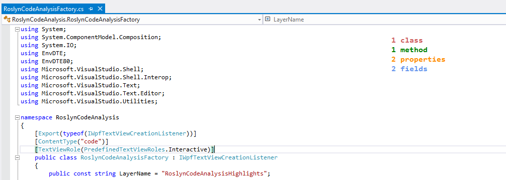
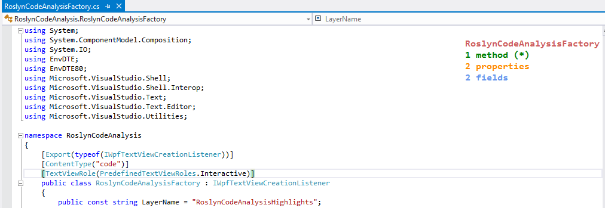
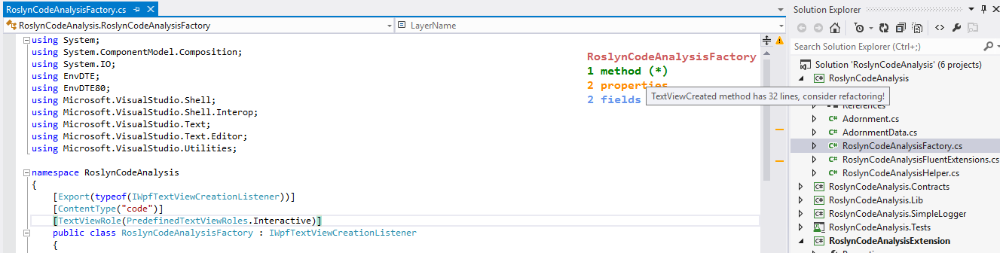
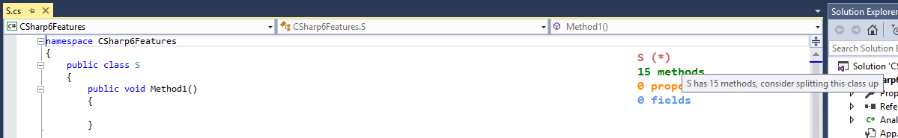
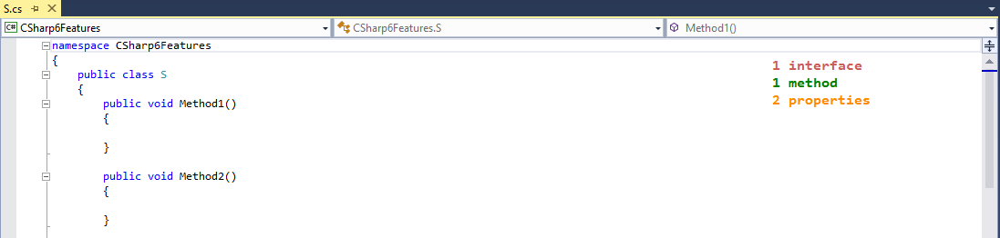

# Roslyn Code Analysis Extension

Looking at the name of the extension, you probably already guessed what this does and also wondering why I didn't come up with a more interesting name :) Just in case, this extension uses various roslyn assemblies like **Microsoft.CodeAnalysis**, **Microsoft.CodeAnalysis.CSharp** in order to analyze the active tab and shows some helpful information. Like this one for instance!

To begin with, you immediately get to see the number of classes in the current tab. Followed by this, every 15 seconds more information about every class is displayed, like this, for example from the same file:

In the above screenshot, you will notice that there is a **(*)** next to the name. This implies that there is more information if you mouseover. In this case the additional information is:

The rules to identify if the number of lines of a method is below a certain number, or if the number of methods in a class is below a certain is defined in various classes under the `RoslynCodeAnalysis.Lib.Rules` namespace. Here is another screenshot of a class that has more than the defined number (10).

Also, if the tab you are viewing also has interfaces, after the number of classes are displayed, you will also see the number of interfaces in the file, like this:

## Installation

To install the extension, download the project, build it and open the RoslynCodeAnalysisExtension\bin\Debug folder, and then double-click on the RoslynCodeAnalysisExtension.vsix file! 
